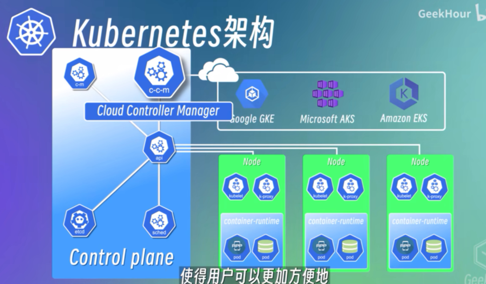

# Kubernetes 的一些基本概念

官方文档-中文：[Kubernetes 文档](https://kubernetes.io/zh-cn/docs/home/)

## Kubernets 组件

官方文档：[Kubernetes 组件](https://kubernetes.io/zh-cn/docs/concepts/overview/components/)

### Node （节点）

Kubernetes 集群中的一个节点，可以是一台物理机，也可以是一台虚拟机

### Pod

Pod 是 kubernetes 的最小调度单元，是**一个或者多个容器**的组合

一般情况下，建议一个 pod 中只运行一个容器，这样耦合性更小。但是，其实一个 pod 中是可以包含多个容器的，

例如边车模式中的 Sidecar 就是作为一个辅助容器和应用容器放到一个 pod 中

### Service （服务）

可以将一组同样的 pod 定义为一个服务，对外提供一个统一的入口来访问这个服务。

服务又可以分为内部服务和外部服务（相对与 kubernetes 集群本身来说），内部服务就是我们在 kubernetes 集群内部使用的服务，并不想暴露到外部，比如我们的数据库，并不想直接对外部提供访问。而外部服务就是外部可以直接访问的，比如一个外部网站。

### Ingress

Ingress 将外部的请求路由到内部集群的 Service 上，从而对外提供服务

### ConfigMap

管理配置信息，都是明文存储的

### Secret

可以对敏感的配置信息做一点点的的”安全“措施 （仅仅是用 base64 编码一下而已），实际的安全还需要借助 kubernetes 的其他组件

### Volumes

跟 docker 的 volumes 概念类似，为容器中的数据做持久化的。

### Deployment

用来部署无状态的应用程序。可以对服务进行自动的扩缩容

### StatefulSet

用来部署有状态的应用服务，跟 Deployment 类似，但是可以管理状态（即有状态）。配置复杂，当前较少使用

比如数据库有可能用这种方式进行部署（但通常可能会将数据库集群单独部署在物理机上，而不是在 kubernetes 集群里，可能还更加简单容易维护）

## Kubernetes 架构

kubernetes 是典型的 Master-Worker 架构，master 节点负责管理整个集群，worker 节点负责执行实际的工作

### Work-Node (工作节点)

每个 Work-Node 上都会包含 3 个组件：kubelet、kube-proxy、container-runtime (容器运行时)。

- kubelet 负责管理和维护当前 Node 上的所有 pod
- kube-proxy 负责为 pod 提供网络代理和负载均衡服务，将请求能够高效的路由到对应的 service 的 pod 中 （比如会优先将请求发往在同一个节点的node，减少网络通信开销
- 所有的 pod 都运行在容器运行时上面，常见的容器运行时有 docker-engine、containerd、CRI-O 等

### Master-Node（主节点）

Master-Node 负责管理所有的 Work-node，Master-Node 上有 4 个基本组件：

- api-server 负责提供 Kubernetes 集群的 api 服务，所有的组件都会通过这个组件进行通信 （网关）
- etcd 用来存储集群中所有资源对象的状态信息，是整个集群的元数据存储。
- ControllerManager 监控集群中各种资源对象的状态，比如 Pod、Node、Service 等，然后根据这些状态来进行相应的响应，确保集群中的各种资源对象都处于我们预期的状态。（使用了 etcd，获取集群资源对象状态）
- Scheduler 调度器，负责监控集群中所有节点的资源使用情况，根据调度策略，将 pod 调度到合适的节点上运行

使用各种云平台的 Kubernetes 服务的话，Master-Node 还会包含另一个组件 Cloud-Controller-Manager，负责与云平台的 API 进行交互，并且可以提供一致的管理接口，使得用户可以更加方便的在不同的云平台上运行和管理他们的应用程序

## Minikube

[你好，Minikube](https://kubernetes.io/zh-cn/docs/tutorials/hello-minikube/)

Minikube 是一个轻量级的 Kubernetes 实现，它可以在本地运行仅包含一个节点的单机的简单集群，用于本地开发和学习。

其他还有类似的产品也可以在本地方便快捷的搭建 Kubernetes 集群，比如 k3s、k3d、kind 等。

我们还需要使用 kubectl 这个命令工具，来和 Kubernetes 集群进行交互。和 Web UI 一样，它也是和 Kubernetes 中的 API Server 进行交互的

## NodePort

外部服务有几种类型，其中一种就是 NodePort，它会在节点上开放一个端口，将这个端口映射到 Service 的 IP 和端口号上。

这样我们就可以通过节点（Node）的 IP 和端口号来访问 Service 了。

在开发和测试阶段，使用这种 IP + 端口号去访问 Service 是没啥问题的，但是最好通过域名的方式来访问 Service。这种时候，就会用到 Ingress.

## Ingress （可以理解为 k8s 的 nginx）

ingress 是用来管理从 k8s 集群外部来访问集群内部服务的入口和方式的。可以通过 Ingress 来配置各种不同的转发规则，从而根据不同的规则，来访问集群内部不同的 Service .

还可以通过 Ingress 来配置域名，这样就不用使用节点的IP 和 端口号这种方式访问 Service 了
